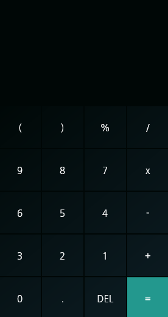

# kordobi_calculator

kordobi-calculator V0.1

Kordobi Calculator is a simple and beautiful calculator for linux desktop
note : this calculator is still in developement, not recommended for daily use

السلام عليكم هذه الالة الحاسبة الجميلة التي انشاة بلغة فلاتر  تعمل على اللينكس لا زالت في مهد التطوير و لا ينصح استعمالها للاغراض الاحترافية

## screenshot



## build

```bash
git clone https://github.com/kherwata/kordobi-calculator
cd kordobi-calculator
flutter pub get
flutter build linux
```

## run

```bash
./build/linux/release/bundle/kordobi_calculator
```

## TODO

- adding more functionalities
- adding light theme 
- adding clear screen button
- fixing overflow bugs
- adding icon

## bugs

if you fing a bug .. feel free to report it
